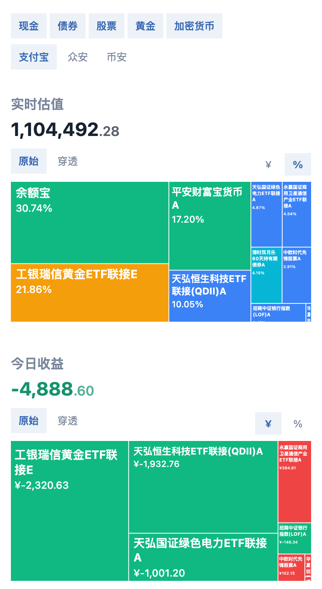

# Aset

本地运行的个人资产看板：
- 能实时看到今天的收益
- 能穿透基金/指数，看清钱最终投向了哪些标的



## 使用方式：说给 AI 听

1. 你说：「我持有工银黄金ETF联接E 73600份，支付宝买的；恒生科技ETF 426000份，同花顺买的」
2. AI 把它整理到 `config.json`
3. 打开页面，看到实时估值、今日收益和股票级穿透

## data/config.json

```jsonc
{
  "positions": [
    {
      "code": "020341",            // 必填：资产代码（裸代码，市场前缀自动识别）
      "type": "fund",             // 必填：fund / etf / stock / crypto / cash
      "shares": 73600,            // 必填：持有份额（正数）
      "name": "工银黄金ETF联接E",   // 可选：显示别名；不写则自动获取网络名（不会写回文件）
      "channel": "支付宝",         // 可选：持有渠道，页面按此筛选
      "assetClass": "gold",       // 可选：整个持仓归为基础元素（现金/黄金/债券/加密）
      "holdings": [              // 可选：实际构成树。一般不用写，程序自动穿透；只有自动拉不到（跨境 ETF 等）才写
        { "code": "518660", "weight": 90 },     //   代码项：程序自动展开/拉行情
        { "assetClass": "cash", "weight": 10 }  //   基础元素项：现金/黄金/债券/加密
      ],
      "recurring": {              // 可选：定投（记录每日定投金额，页面展示用）
        "frequency": "daily",
        "amount": 100,
        "nextDate": "2026-08-15"
      }
    }
  ]
}
```

## 快速开始

```bash
bun install
bun run dev
```

打开 http://localhost:5173/ 。

## 注意

- 跨境 ETF 可能没有公开持仓，需搜索互联网查成分股后用 `holdings` 覆盖
